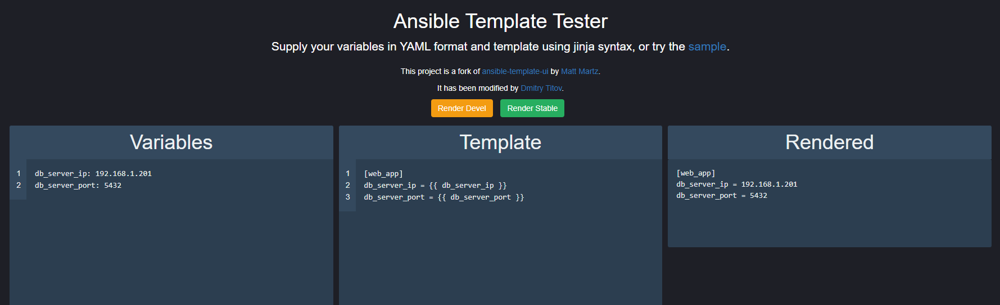

# ansible-template-ui
Web UI for testing ansible templates

## New UI


## Docker Container

### Pull

```
docker pull sivel/ansible-template-ui:devel
```

### Build

```
docker build -t ansible-template-ui:devel docker/devel
```

## Web App

### Dev

```
python -m ansible_template_ui
```

### Production

#### PEX

```
pip install pex
./build_pex.sh
ansible_template_ui.pex -k gevent ansible_template_ui:app
```

#### Without PEX

```
pip install -r requirements.txt -r deploy-requirements.txt
gunicorn -k gevent ansible_template_ui:app
```
